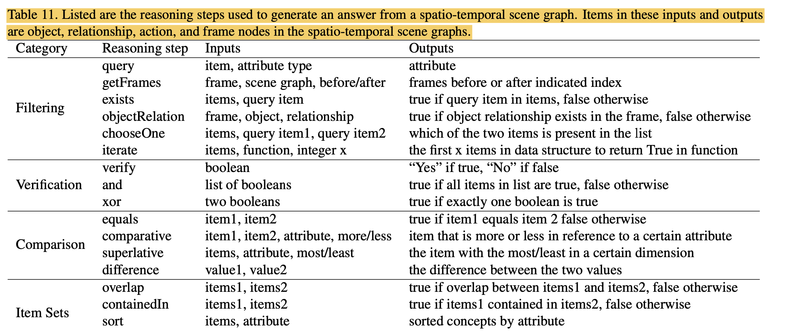
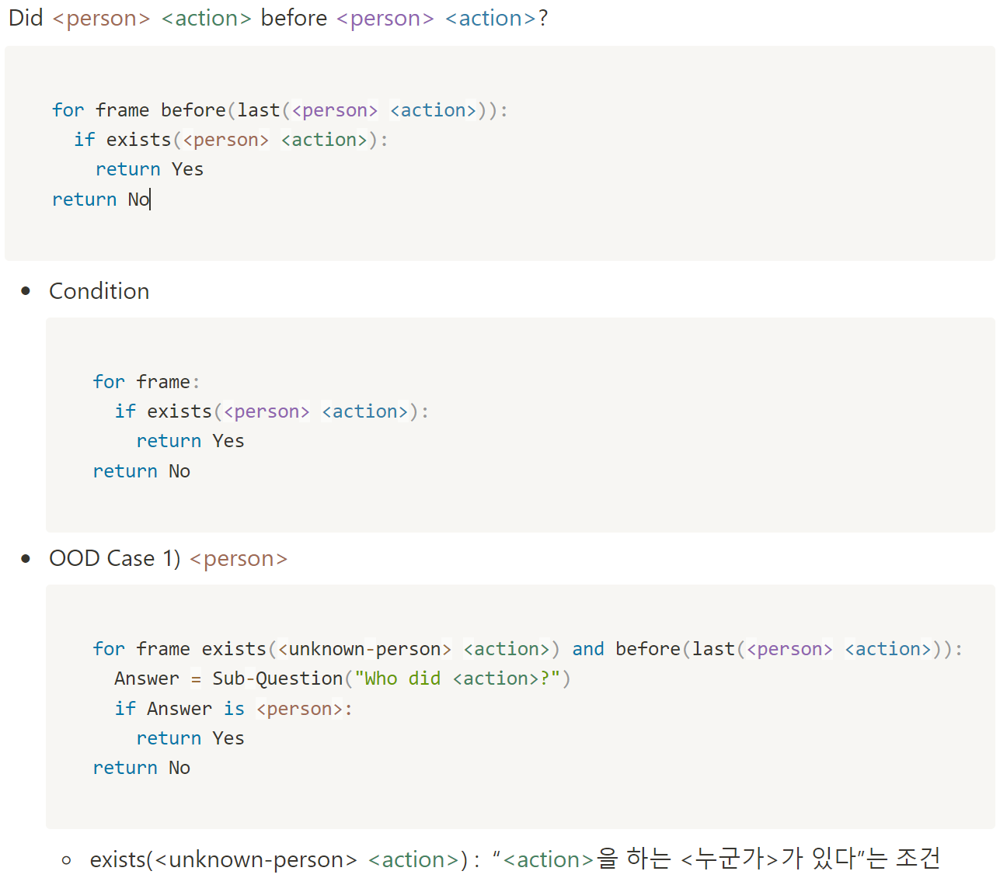
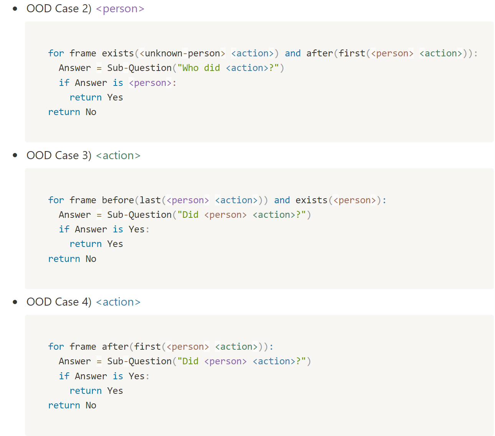

# 1단계 과제 목표: 데이터셋 설계 및 확보

---

## 1차년도
- 기술검증 실험을 위한 OOD 정보를 내포하고 OOD 해결을 위한 올바른 정보도 알고 있는 데이터셋 설계
- 기존 멀티모달 시계열 데이터 관련 데이터셋에 다양한 시구간 길이에 기반한 물체, description 등의 메타정보 데이터셋 구축 계획 수립.

## 2차년도
- 멀티모달 시계열 데이터 OOD 정보에 대한 불확실성 자각 및 질문 성장 기술 검증 데이터셋 설계 및 데이터 검수 및 보강 


## 3차년도
- 멀티모달 시계열 데이터 자가 선학습 및 지식 성장 학습을 위한 대규모 데이터셋 구축 및 공개


---


# 1차년도: 데이터셋 설계

## 기술검증 실험을 위한 OOD 정보를 내포하고 OOD 해결을 위한 올바른 정보도 알고 있는 데이터셋 설계

### 설계 기준

어떤 질문을 할것인가? 어떤 보조질문을 만드는 것이 좋을까?
- 질문 내용 중 OOD label의 후보가 될 수 있는 인물/물체/장소/관계 등을 포함하여야 함
- 보조질문을 명확하게 만들 수 있어야 함
    - 보조질문을 명확하게 만들 수 있으려면 질문 해결을 위한 Reasoning 단계를 논리적으로 표현해야함

### AGQA-like 데이터셋 설계 기준 수립
- 기존의 또오해영(DramaQA) 데이터셋 annotation을 바탕으로 대답할 수 있는 질문 template을 생성
- 추후, 2차년도 상반기 중 만들어질 한양대 module의 결과인 Video Scene graph를 바탕으로 질문 template을 추가 확장할 수 있음



### 기존 또오해영 데이터셋의 annotation 정보
```
https://dramaqa.snu.ac.kr/Dataset 참조
- person
    - person id (ex. Haeyoung1)
    - behavior (ex. stand up)
    - emotion (ex. angry)
    - bbox
    - related_objects (특정 사람과 연관되어 있는 물체)
        - 일부의 object만 tagging되어 있음
        - bbox
- object
    - object class (ex. vase)
    - bbox
- place (ex. park)
- QA
    - 질문 template 생성이 목표이므로 QA는 데이터셋 추가 확보에는 사용하기 어려움
```
### 템플릿 형식

- 중요 entity를 2개 이상 포함하며 reasoning step이 최소 2 이상 되는 메인 질문(main-question)
  - 모든 질문에 대한 정답 유형은 “단답형(open-1-word)”으로 고정함
  - 해당 질문에 대한 pseudo code 기술 
  - Condition: 해당 질문이 valid할 수 있는 frame(혹은 clip)에 대한 조건을 기술
  - OOD case: 각 entity 또는 기타 상황에 불확실성(uncertainty)가 존재하는 경우 해당 불확실성에 대해 어떤 보조 질문(sub-question)을 생성할 수 있는지 기술

### Template #1 actExistsBefore





`Did <person> <action> before <person> <action>?`

```python
for frame before(last(<person> <action>)):
    if exists(<person> <action>):
        return Yes
return No
```

- Condition
    
```python
for frame:
    if exists(<person> <action>):
        return Yes
    
return No
```
    
- OOD Case 1) <person>
    
```python
for frame exists(<unknown-person> <action>) and before(last(<person> <action>)):
    Answer = Sub-Question("Who did <action>?")
    if Answer is <person>:
        return Yes
    
return No
```
`exists(<unknown-person> <action>)` :  “`<action>`을 하는 <누군가>가 있다”는 조건


- OOD Case 2) <person>
    
```python
for frame exists(<unknown-person> <action>) and after(first(<person> <action>)):
    Answer = Sub-Question("Who did <action>?")
    if Answer is <person>:
        return Yes
    
return No
```
    
- OOD Case 3) <action>
    
```python
for frame before(last(<person> <action>)) and exists(<person>):
    Answer = Sub-Question("Did <person> <action>?") 
    if Answer is Yes:
        return Yes
    
return No
```
    
- OOD Case 4) <action>
    
```python
for frame after(first(<person> <action>)):
    Answer = Sub-Question("Did <person> <action>?") 
    if Answer is Yes:
        return Yes
    
return No
```

총 21개의 annotation 기반 template을 만든 결과를 기술함.  
아래에는 위의 pseudo code를 전부 기술하지 않고 template 이름 및 형태만 기술함.  
각 template의 이름은 질문이 묻고자 하는 바를 간략화하여 나타낸 것임.

- Template #1 actExistsBefore
  - `Did <person1> <action1> after <person2> <action2>?`
- Template #2 actExistsAfter
  - `How did <person1> feel before <person2> <action>?`
- Template #3 emoHowBefore
  - `How did <person1> feel before <person2> <action>?`
- Template #4 emoHowAfter
  - `How did <person1> feel after <person2> <action>?`
- Template #5 plcWhereBefore
  - `Where was <person> before <person> was at <place>?`
- Template #6 plcWhereAfter
  - `Where was <person1> after <person> was at <place>?`
- Template #7 SamePlcWhenAct
  - `Were <person1> and <person2> in the same place when <person1> <action>?`
- Template #8 actWhereObj 
  - `Did <person> <action> at <place>?`
- Template #9 emoWhenAct
  - `What was <emotion> when <person> <action>?`
- Template #10 plcWhenAct 
  - `Did <person> <action> was at <place>?`
- Template #11 relExistsWhile 
  - `Is (does) <person> <relationship> <object> while <person> <action>?`
- Template #12 relExistsBefore
  - `Did <person> <relationship> <object> before <person> <action>?`
- Template #13 relExistsAfter 
  - `Did <person> <relationship> <object> after <person> <action>?`
- Template #14 actUsingObj 
  - `What did <person> do first using <object>?`
- Template #15 placeWheremeet 
  - `Did <person> do first using <object>?`
  - `Where <place> did <person> and <person> meet?`
- Template #16 relatedObjWhileAct
  - `What is <object> interacted with <person>  when <person> <action>?`
- Template #17 whoExistsBefore
  - `Who(<anyone>) are with in there  with <person> before <person> <action>?`
- Template #18 whoFeelingEmoWhenAct
  - `Who(<anyone>) was feeling <emotion> when <person> <action>?`
- Template #19 actLengthLongerCompare 
  - `Was the <person> <action1> or <action2> for longer?`
- Template #20 actLengthShorterCompare
  - `Was the person <action>or <action>for less time?`
- Template #21 objTime
  - `Did the <person> contact a <object> before <action>?`
  - `<object> : related object in person annotation`

###

---
